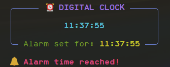

# ⏰ Alarm Clock

A colorful terminal-based digital alarm clock built with Python, using the [`rich`](https://github.com/Textualize/rich) library for beautiful output and `pygame` for playing an alarm sound.

---

## 🌟 Features

- Live updating digital clock in your terminal
- Clean and colorful display using `rich`
- Plays an alarm sound when the set time is reached
- Compatible with Windows, macOS, and Linux

---
## 📸 Example Output



---

## 📦 Requirements

Make sure you have Python installed, then install the required packages:

```bash
pip install rich pygame
```

---

## 🚀 How to Run
1. Clone or download this project.
```bash
git clone https://github.com/Dangle117/Projects.git
cd alarm_clock
```
2. Open a terminal in the project folder.
3. Run the script:

```bash
python main.py
```

4. When prompted, enter the alarm time in `HH:MM:SS` format (e.g., `07:30:00`)