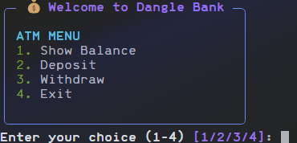
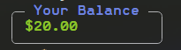

# 💰 Dangle Bank - Terminal Banking Program

Dangle Bank is a simple and interactive terminal-based banking program written in Python. It uses the [Rich](https://github.com/Textualize/rich) library to enhance the user interface with colorful formatting, panels, and prompts.

---

## 🎯 Features

- ✅ View account balance  
- 💵 Deposit money  
- 🏧 Withdraw money  
- 🚪 Exit the program  

---

## 🖥️ Screenshots




---

## 🧠 How It Works

- The balance is stored in memory (`float value`).
- The program runs in a loop until the user exits.
- Inputs are validated using `Rich prompts`.
- The `Rich` library formats text with colors and panels.

---

## 📦 Requirements

- Python 3.7 or later
- `rich` library

Install dependencies using pip:

```bash
pip install rich
```

## 🚀 How to Run

1. Clone this repository or copy the Python script.

```bash 
git clone https://github.com/Dangle117/Projects.git
cd banking_program
```

2. Run the script:

```bash
python main.py
```

3. Follow the on-screen menu to interact with the banking system.

