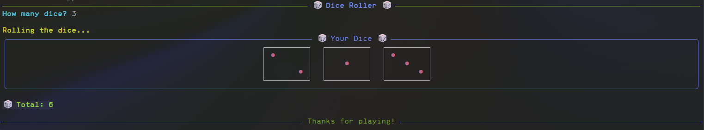

# 🎲 Dice Roller

A colorful and interactive terminal-based dice rolling app built with Python and the [Rich](https://github.com/Textualize/rich) library. This project simulates rolling one or more dice with a beautiful ASCII display, colored dots, and live status animations.

---

## ✨ Features

- Roll as many dice as you want
- Displays visually styled dice with colored pips (`●`)
- Real-time "shuffling" animation using spinners
- Colorful output using the Rich library
- Clean, readable, and beginner-friendly code

## 📸 Demo



---

## 🧠 How It Works

- Dice faces are drawn using ASCII art and `●` symbols.
- The `[red]●[/red]` syntax is used to color dots with Rich's markup.
- `console.status()` and Spinner create the rolling animation.
- Dice results are displayed inside a `Panel` with `Align.center`.

---

## 🔨 Requirements

- Python 3.7+
- `rich` library

## 📦 Installation

1. Clone the repository or copy the code.

```bash
git clone https://github.com/Dangle117/Projects.git
cd dice_roller
```

2. Install the required package:

```bash
pip install rich
```

## 🚀 Usage
Run the program using:

```bash
python main.py
```

You will be prompted to enter the number of dice to roll.

