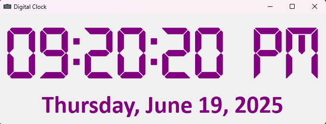

# 🕒 Digital Clock App (PyQt5)

A sleek and modern **digital clock** application built using **PyQt5**. It displays the current **time** and **date**, styled with a custom font and a clean interface.

---

## 📌 Features

- 🕘 Real-time digital clock (updates every second)
- 📆 Displays the current date in full format
- 🎨 Custom font styling and centered layout
- 💜 Elegant purple color scheme
- 🖼️ Custom window icon

---

## 🛠️ Technologies Used

- **Python 3**
- **PyQt5** for GUI components
- **QTimer** for time updates
- **QTime** and **QDate** for system time and date
- **QFontDatabase** for custom font integration

---

## 🔍 Code Overview

- DigitalClock class:
    - Sets up the UI window, styles, and layout
    - Uses QTimer to refresh the time every second
    - Loads a custom .ttf font for the time display

- update_time() method:
    - Retrieves and displays current time in `hh:mm:ss AP` format
    - Displays date like `Thursday, June 19, 2025`


---

## 📸 Preview



---

## 🚀 Getting Started

1. Install Dependencies

- Ensure you have Python installed (Python 3.7+ recommended).

- Install PyQt5 using pip:

```bash
pip install pyqt5

```

2. Run the App

```bash
python main.py
```
