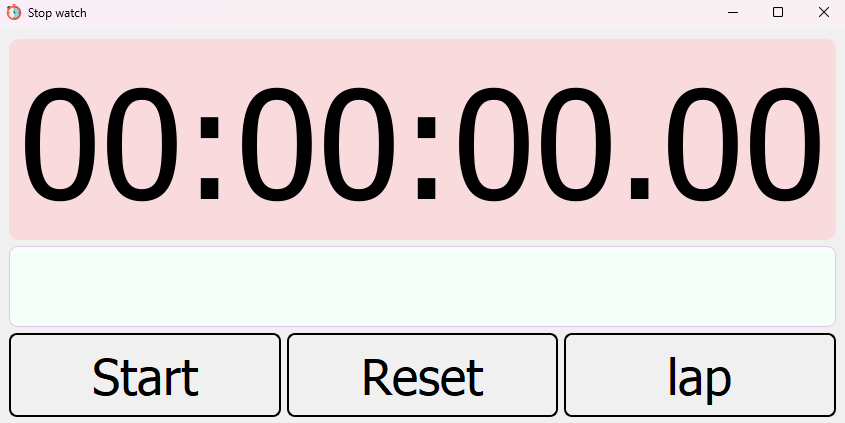

# ⏱️ PyQt5 Stopwatch App

A stylish and user-friendly stopwatch application built with PyQt5. It features start/stop control, lap recording, and reset functionality—all wrapped in a modern UI.

--- 

## 🖼️ Features

- Start/Stop the timer with a single button
- Lap recording with automatic scroll to the latest lap
- Reset button to clear the timer and laps
- Modern GUI with custom styling
- Lap list view to track multiple lap times
- Keyboard and mouse-friendly interface

---

## 🛠️ Tech Stack

- Python 3.7 or latest
- `PyQt5` for GUI
- `QTimer` & `QTime` for time management

---

## 📸 Screenshot



---

## 🚀 Getting Started

Install PyQt5 using pip:
    
``` bash
pip install pyqt5
```

Run the App
    
```bash
python main.py
```

