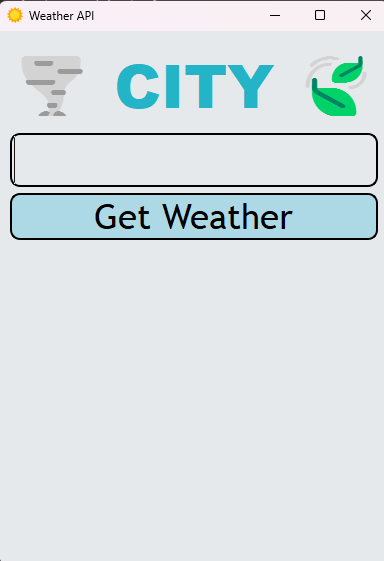
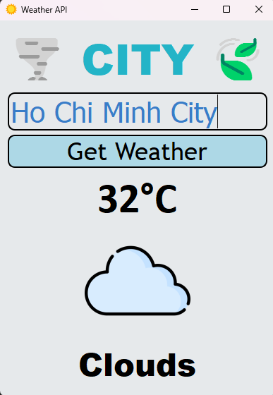

# 🌦️ Weather API App
A simple desktop weather application built with `PyQt5` that displays the current weather of a city using the OpenWeatherMap API.

---

## 📌 Features
- 🔍 Search weather by typing a city name

- 🌡️ Shows temperature in Celsius

- 🌤️ Displays weather condition with a matching icon

- ⚠️ Handles errors like wrong city name or connection issues

- 💻 Clean and user-friendly interface with PyQt5

---

## 🖥️ Screenshot



---

## ❗ Error Messages

This app handles common API errors:

- `404` — City not found

- `401` — Invalid API key

- `429` — Too many requests

- Network issues or timeouts

---

## 🛠️ How to Use

1. Clone the project
``` bash
git clone https://github.com/Dangle117/Projects.git
cd weather_api
```

2. Install the required packages

``` bash
pip install PyQt5 requests
```
3. Add your API key
- Go to https://openweathermap.org/api, sign up, and get your API key.
- Then, in the code file `main.py`, replace this line:

```bash 
api_key = API_KEY
```
- with your own API key:

``` bash
api_key = "YOUR_API_KEY_HERE"
```
4. Run the app
``` bash
python main.py
```


---

## 📦 Requirements

- Python 3.7+

- `PyQt5`

- `requests`

