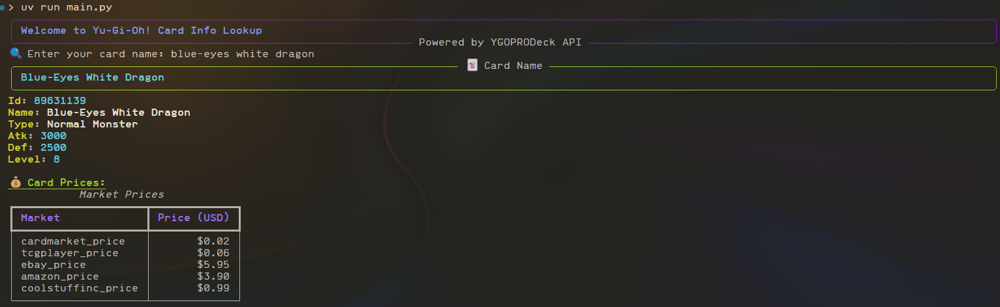

# 🃏 Yu-Gi-Oh! Card Info Lookup

This is a simple Python terminal application that lets you search for **Yu-Gi-Oh! trading cards** by name and view their stats and prices. It uses the [YGOPRODeck API](https://db.ygoprodeck.com/api-guide/) and provides a visually appealing terminal interface using the `rich` library.

---

## 📦 Features

- 🔎 Search for any Yu-Gi-Oh! card by name
- 📊 View card stats: `ID`, `Name`, `Type`, `ATK`, `DEF`, `Level`
- 💰 Get real-time market prices from multiple sources
- 🎨 Styled terminal output using `rich` for better readability

---

## 🛠️ Installation

1. Clone the repository:

```bash
git clone https://github.com/Dangle117/Projects.git
cd yugioh_API
```

2. Create and activate a virtual environment
```bash
python -m venv venv
source venv/bin/activate  # On Windows: venv\Scripts\activate
```

3. Install required libraries:
```bash
pip install requests rich
```

## 🚀 Usage
```bash
python main.py
```

Then enter a card name when prompted (e.g. Dark Magician)

---

## 🖼️ Example Output



---

## 🔗 API Reference

- YGOPRODeck API: https://db.ygoprodeck.com/api-guide/
